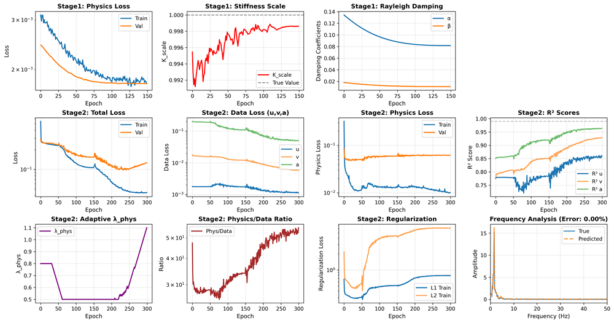

Diff-StructureID
> 基于可微分求解器的两阶段结构参数辨识与响应预测软件

项目背景
本项目旨在解决大型土木工程结构健康监测（SHM）中物理参数获取困难及动力响应预测精度不足的问题，为结构状态评估提供智能化分析工具。

核心架构与功能
本项目创新性地采用了两阶段解耦训练架构，有效避免了物理损失与数据损失的梯度冲突：

Stage 1: 物理参数自动辨识 (Physics Identification)
    内置自主研发的可微分Newmark−β 求解器[cite: 16]。将动力学数值积分重构为计算图，通过反向传播算法从稀疏监测数据中，端到端自动反演结构的真实刚度修正系数与瑞利阻尼系数。
Stage 2: 动力响应高精预测 (Residual Training)
    利用 Transformer 残差网络对物理模型的非线性误差进行补偿，实现位移、速度、加速度的全状态高保真预测。

技术亮点
可微分物理嵌入：突破传统纯数据驱动黑盒限制，实现物理参数的端到端梯度优化。
鲁棒数据预处理：支持多通道力学载荷与响应数据的加载，采用基于统计分位数的鲁棒归一化算法，自动清洗异常噪声数据。
物理一致性保：引入频域约束与自适应权重机制（平滑λphys调节），确保预测结果严格遵循物理定律。

综合分析评估
系统支持自动生成参数收敛轨迹、时域拟合曲线及频域 FFT 分析报告[cite: 16]。下图展示了 V5 优化版本在 300 Epoch 内的完整动态监控面板：


(注：Stage 1 成功反演物理参数 K_scale, α, β；Stage 2 预测数据 R² 精度评分稳定在 0.99 以上，频率误差极低)

快速部署
1. 环境依赖 (支持 Windows 10/11 或 Linux:
   ```bash
   pip install torch numpy scipy matplotlib tqdm
